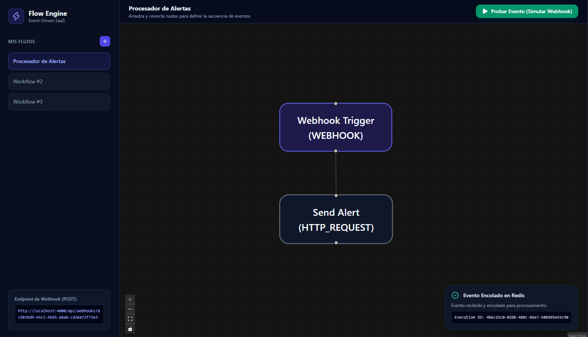

# ⚡ Event-Driven Workflow Automation Engine

An asynchronous, event-driven workflow automation SaaS platform (*n8n / Zapier style*). Designed with a **distributed and decoupled architecture** utilizing background message queues to guarantee fault tolerance, automatic retries, and non-blocking low-latency response times.

<p align="center">
  
</p>

---

## 📐 System Architecture

```text
[ Webhook Client / Trigger ]
            │ (HTTP POST Event)
            ▼
┌─────────────────────────┐
│   API Server (Express)  │ ──(Logs execution as PENDING)──► [ PostgreSQL + Prisma ]
└─────────────────────────┘
            │
            │ (Enqueues job asynchronously)
            ▼
┌─────────────────────────┐
│   Redis Queue (BullMQ)  │
└─────────────────────────┘
            │
            │ (Processes jobs in background)
            ▼
┌─────────────────────────┐
│   Worker Engine (Node)  │ ──(Executes node sequence & updates logs)
└─────────────────────────┘
```

### Key Components:
* **API Server (Express + TypeScript):** Instant webhook ingestion, workflow management, and fast non-blocking `202 Accepted` HTTP responses.
* **Worker Engine (BullMQ + Redis):** Decoupled background processing with exponential backoff retries and step-by-step node execution.
* **Relational Persistence (PostgreSQL + Prisma ORM):** Structured storage for workflows, edges, node schemas, and complete execution audit trails.
* **Visual Builder (React + React Flow + Tailwind):** Interactive frontend canvas for visual workflow building and real-time event testing.

---

## 🛠️ Tech Stack

* **Backend & Workers:** Node.js, TypeScript, Express, BullMQ, ioredis.
* **Database & Caching:** PostgreSQL 16, Prisma v6 ORM, Redis 7.
* **Frontend:** React 19, TypeScript, React Flow (`@xyflow/react`), Tailwind CSS v3, Vite.
* **Infrastructure & DevOps:** Docker, Docker Compose, Nginx.

---

## 🚀 Quick Start with Docker Compose

The entire application is containerized and can be launched with a single command across any OS (Linux, macOS, Windows).

### Prerequisites
* [Docker](https://docs.docker.com/get-docker/) & [Docker Compose](https://docs.docker.com/compose/install/) installed and running (via Docker Engine, Docker Desktop, or an equivalent container runtime).

### Deployment:
```bash
# 1. Clone the repository
git clone [https://github.com/SnakeJuice/workflow-automation-saas.git](https://github.com/SnakeJuice/workflow-automation-saas.git)
cd workflow-automation-saas

# 2. Spin up the full multi-container stack
docker compose up --build
```

### Exposed Services:
* 🎨 **Frontend Visual Builder:** [http://localhost:3000](http://localhost:3000)
* ⚡ **API Server & Healthcheck:** [http://localhost:4000/health](http://localhost:4000/health)
* 🗄️ **PostgreSQL Port:** `5432`
* 🔴 **Redis Port:** `6379`

---

## 💻 Local Development

If you want to run the code locally with hot reloading enabled:

1. **Spin up only the database & cache services in Docker:**
   ```bash
   docker compose -f docker-compose.dev.yml up -d
   ```

2. **Start the API Server & Worker Engine:**
   ```bash
   cd server
   npm install
   npx prisma db push
   npm run dev       # Terminal 1: API Server
   npm run worker    # Terminal 2: Worker Engine
   ```

3. **Start the Frontend Application:**
   ```bash
   cd client
   npm install
   npm run dev       # Terminal 3: Vite Dev Server (http://localhost:5173)
   ```

---

## 📌 Main API Endpoints

| Method | Endpoint | Description |
| :--- | :--- | :--- |
| `GET` | `/health` | Event engine health check |
| `GET` | `/api/workflows` | Retrieves all saved workflows |
| `POST` | `/api/workflows` | Creates a new workflow |
| `POST` | `/api/webhooks/:workflowId` | Triggers a workflow event & enqueues it in Redis |

---

## 📝 License

Distributed under the MIT License.